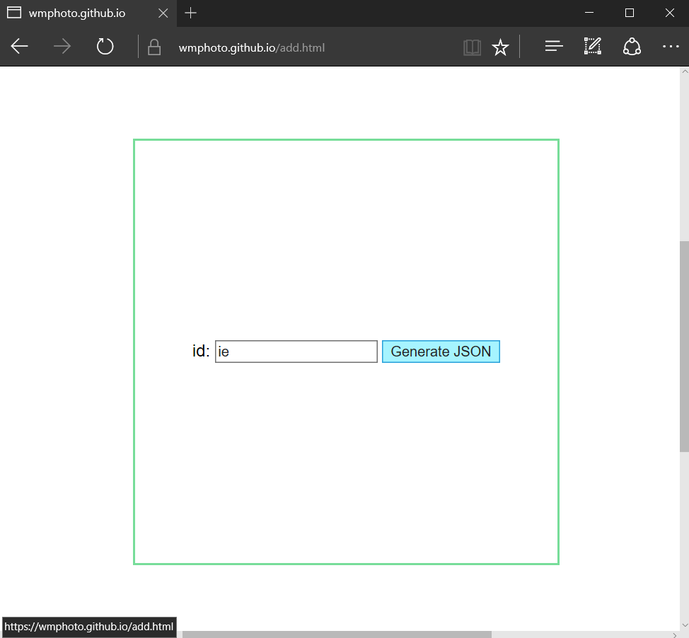

# wmphoto.github.io

## Getting this repo 

You should all have GitHub Desktop installed on your computers. If this repo isn't listed on the GitHub Desktop application, go to the <a href="https://github.com/wmphoto/wmphoto.github.io">repo page</a> and click on the **Clone or download** button. A small menu should appear, and you should then click on **Open in Desktop**. Choose where the repo should be stored, and you're set to go.

## Adding images 

Before *changing anything* in the local files, make sure you're looking at the most current version of the site. In Github Desktop, click **Fetch** or **Pull**. If the program says you have uncommitted changes, navigate to the **Changes** tab, right click on the **changed files** bar at the top, and click **Discard all changes**. 

Now go to <a href="https://wmphoto.github.io/add.html">wmphoto.github.io/add.html</a>. To choose where you'll place your image, put your mouse over an empty square. The square should have a green outline **(1)**.  Click on the square to select it. A text input box and button should appear. Type your two-letter id into the box and click on the **Generate JSON** button **(2)**. Now, a JSON entry should appear in the box **(3)**. 

| 1. | 2. | 3. |
| :----------------------- | :----------------------- | :----------------------- |

Copy and paste this JSON into **data.js**. Add both the large and small images folder with the name given on the "img" row of the JSON. **YOUR IMAGE'S FILENAMES MUST MATCH THE FILENAMES IN data.js**. Filenames are case-sensitive.

Now open your local copy of **index.html** and compare it with the <a href="https://wmphoto.github.io">wmphoto site</a> to make absolutely certain that your local version of the page is up to date. If your image shows up on **index.html** and all the images from the <a href="https://wmphoto.github.io">wmphoto site</a> are also there, you can write a commit message in the GitHub Desktop Application and commit your changes by clicking the **commit** button. Then, click **Push** to put your changes on the live site.

## Image naming/sizing

Name your files *exactly* as the site tells you to.

Only upload **.jpg** files. The small version of the image should be **500** pixels on the long side. Your large version of the image should be **2000** pixels on the long side. Make your images as small as possible - users will be loading tens of images at a time, and we want the page to load quickly. 

For each file, click **File** > **Export** > **Save for Web**. In **Save for Web**, make sure the box *below* **Preset** says **JPEG** (not GIF). Make sure **Optimized** is checked, and set **Quality** to 60. Make sure **Convert to sRGB** is checked.

## Updating your profile

**profile.js** has the two-letter ids that belong to each of you. When you get a chance, fill in the missing information. Use the same caution here as when you are adding images.
